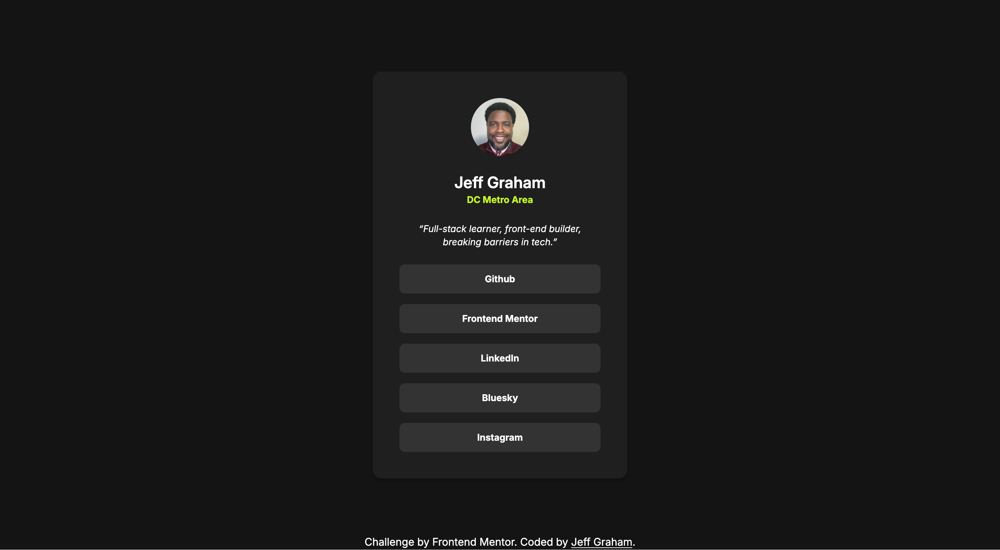

# Frontend Mentor - Social links profile solution

This is a solution to the [Social links profile challenge on Frontend Mentor](https://www.frontendmentor.io/challenges/social-links-profile-UG32l9m6dQ). Frontend Mentor challenges help you improve your coding skills by building realistic projects.

## Table of contents

- [Overview](#overview)
  - [The challenge](#the-challenge)
  - [Screenshot](#screenshot)
  - [Links](#links)
- [My process](#my-process)
  - [Built with](#built-with)
  - [What I learned](#what-i-learned)
  - [Continued development](#continued-development)
  - [Useful resources](#useful-resources)
- [Author](#author)

## Overview

### The challenge

Users should be able to:

- See hover and focus states for all interactive elements on the page

### Screenshot



### Links

- Solution URL: [Github Repo](https://github.com/jeffgrahamcodes/social-links-profile)
- Live Site URL: [https://social-links-profile-ecru.vercel.app/](https://social-links-profile-ecru.vercel.app/)

## My process

### Built with

- Semantic HTML5 markup
- CSS custom properties
- Flexbox
- Mobile-first workflow
- [Tailwind](https://tailwindcss.com/) - CSS Framework

### What I learned

This project was a great opportunity to practice styling from scratch with Tailwind CSS and reinforce the importance of semantic HTML. I started by modifying the starter file to better reflect my own brand identity and structure.

- I customized the profile image, name, and location, using my own avatar and info.
- I replaced placeholder content with my actual bio and social links, adding semantic elements like `<main>`, `<section>`, and `<nav>`.
- I made the layout responsive by introducing Tailwind’s `sm:` breakpoint and updated the padding based on screen size.
- I added hover interactions to links and buttons, improving accessibility and interactivity.
- I refined custom color variables and made use of CSS logical properties for maintainable styling.

Here's a snippet I’m proud of for its clarity and modularity:

```html
<nav class="text-sm font-bold min-w-full">
  <ul class="grid gap-4">
    <li
      class="bg-(--gray-700) p-3 rounded-lg cursor-pointer hover:bg-(--green) hover:text-(--gray-800)"
    >
      <a href="https://github.com/jeffgrahamcodes" target="_blank"
        >Github</a
      >
    </li>
    <!-- Other social links... -->
  </ul>
</nav>
```

### Continued development

I’d like to continue refining my Tailwind setup, particularly around managing larger design systems with custom themes. I also want to improve my accessibility practices, including focus states and screen reader support.

### Useful resources

- [HTML Semantics Cheat Sheet](https://learntheweb.courses/topics/html-semantics-cheat-sheet/) - This helped get rid of the warnings from the accessibility report.
- [Tailwind Cheat Sheet](https://nerdcave.com/tailwind-cheat-sheet) - Cheat sheet to quickly find Tailwind class names and CSS properties .

## Author

- Website - [jeffgraham.codes](https://www.jeffgraham.codes)
- Frontend Mentor - [@jeffgrahamcodes](https://www.frontendmentor.io/profile/jeffgrahamcodes)
- Bluesky - [@jeffgrahamcodes.bsky.social](https://bsky.app/profile/jeffgrahamcodes.bsky.social)
